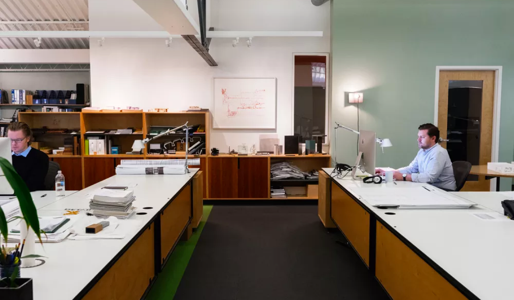
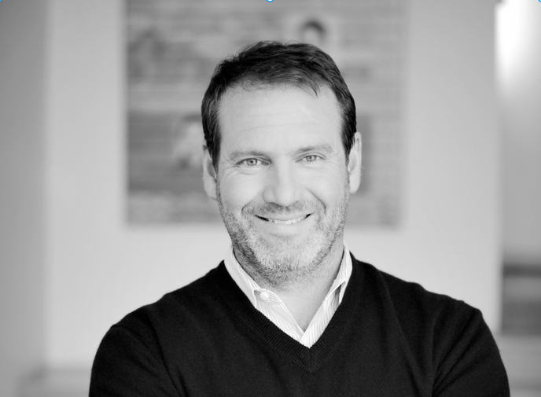

    

        <h2>
        We chase big ideas  in the middle  of everywhere.
        </h2>
        
Established in 1996, El Dorado is an integrated architecture, urban design, curatorial, education and fabrication practice located approximately in Kansas, Missouri.
        <a href="#" id="viewBtn">Read MoreLess</a></a>

    

    

    <h2>Principals</h2>
    

        <a href="/team/david-dowell">
            
            <h4>David Dowell</h4>
            <h5>Principal</h5>
        </a>
        <a href="/team/josh-shelton">
            
            <h4>Josh Shelton</h4>
            <h5>Principal</h5>
        </a>
    

    <h2>Our team works purposefully across scales and contexts.</h2>
    

        <a href="/team/john-smith">
            <h4>John Smith</h4>
            <h5>Architect</h5>
        </a>
        <a href="/team/#">
            <h4>John Smith</h4>
            <h5>Architect</h5>
        </a>
        <a href="/team/#">
            <h4>John Smith</h4>
            <h5>Architect</h5>
        </a>
        <a href="/team/#">
            <h4>John Smith</h4>
            <h5>Architect</h5>
        </a>
        <a href="/team/#">
            <h4>John Smith</h4>
            <h5>Architect</h5>
        </a>
        <a href="/team/#">
            <h4>John Smith</h4>
            <h5>Architect</h5>
        </a>
        <a href="/team/#">
            <h4>John Smith</h4>
            <h5>Architect</h5>
        </a>
        <a href="/team/#">
            <h4>John Smith</h4>
            <h5>Architect</h5>
        </a>
        <a href="/team/#">
            <h4>John Smith</h4>
            <h5>Architect</h5>
        </a>
        <a href="/team/#">
            <h4>John Smith</h4>
            <h5>Architect</h5>
        </a>
        <a href="/team/#">
            <h4>John Smith</h4>
            <h5>Architect</h5>
        </a>
        <a href="/team/#">
            <h4>John Smith</h4>
            <h5>Architect</h5>
        </a>
        <a href="/team/#">
            <h4>John Smith</h4>
            <h5>Architect</h5>
        </a>
        <a href="/team/#">
            <h4>John Smith</h4>
            <h5>Architect</h5>
        </a>
        <a href="/team/#">
            <h4>John Smith</h4>
            <h5>Architect</h5>
        </a>
        <a href="/team/#">
            <h4>John Smith</h4>
            <h5>Architect</h5>
        </a>
    

    <h2>News</h2>
    <ul>
        <li><a href="#" target="_blank">
                
Waldo site set for redevelopment and new retail, service and office tenants

                
Kansas City Star January 11, 2018

        </a></li>
        <li><a href="#" target="_blank">
                
2018 Capstone Winners

                
Kansas City Star January 11, 2018

        </a></li>
        <li><a href="#" target="_blank">
                
Waldo site set for redevelopment and new retail, service and office tenants

                
Kansas City Biz Journal January 11, 2018

        </a></li>
        <li><a href="#" target="_blank">
                
Three Local Projects Win 2017 Residential Design Awards

                
Midcoast Design Record January 11, 2018

        </a></li>
        <li><a href="#" target="_blank">
                
Waldo site set for redevelopment and new retail, service and office tenants

                
Kansas City Star January 11, 2018

        </a></li>
        <li><a href="#" target="_blank">
                
2018 Capstone Winners

                
Kansas City Star January 11, 2018

        </a></li>
        <li><a href="#" target="_blank">
                
Waldo site set for redevelopment and new retail, service and office tenants

                
Kansas City Star January 11, 2018

        </a></li>
        <li><a href="#" target="_blank">
                
2018 Capstone Winners

                
Kansas City Star January 11, 2018

        </a></li>
        <li><a href="#" target="_blank">
                
Waldo site set for redevelopment and new retail, service and office tenants

                
Kansas City Biz Journal January 11, 2018

        </a></li>
        <li><a href="#" target="_blank">
                
Three Local Projects Win 2017 Residential Design Awards

                
Midcoast Design Record January 11, 2018

        </a></li>
        <li><a href="#" target="_blank">
                
Waldo site set for redevelopment and new retail, service and office tenants

                
Kansas City Star January 11, 2018

        </a></li>
        <li><a href="#" target="_blank">
                
2018 Capstone Winners

                
Kansas City Star January 11, 2018

        </a></li>
        <li><a href="#" target="_blank">
                
Waldo site set for redevelopment and new retail, service and office tenants

                
Kansas City Star January 11, 2018

        </a></li>
        <li><a href="#" target="_blank">
                
2018 Capstone Winners

                
Kansas City Star January 11, 2018

        </a></li>
    </ul>

